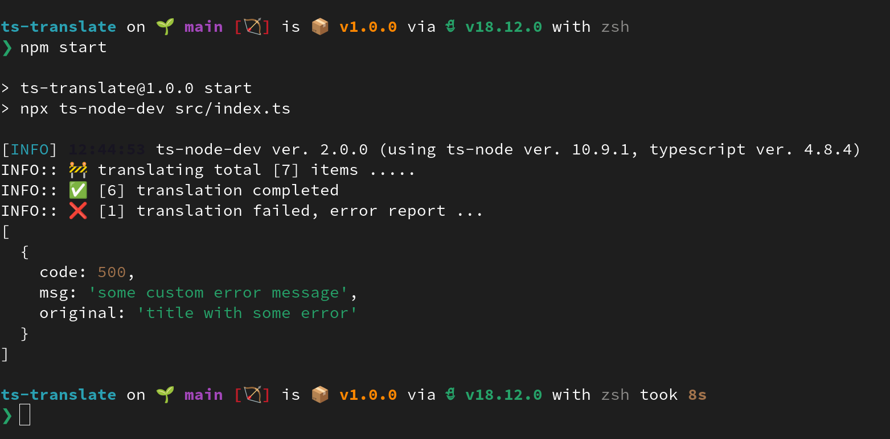
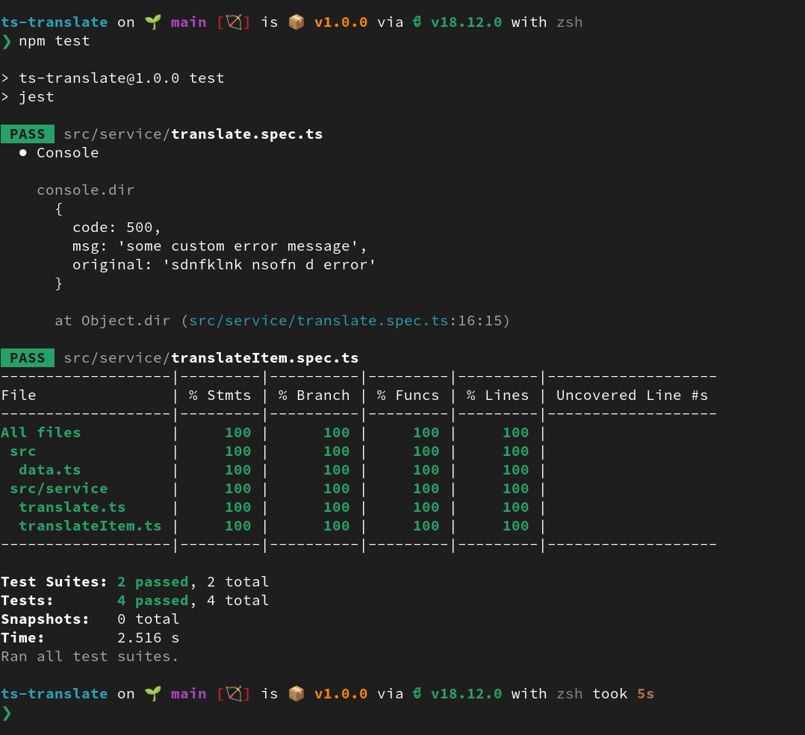

# TS-TRANSLATE

### Acceptance Criteria

-   [x] The items `title` and `description` will be translated in German
-   [x] Once translation is complete, the complete item will be displayed (a simple console.log or a file write should be enough)

## How to run

install the dependencies using the correct version of nodejs

```
nvm use
npm install

npm start
```



### Tests

```
npm test
```



### design decision

-   script created a Promise for each translation, which could be executed asynchronousely in parallel
-   Once all translation are resolved the data-object could be used to write/update a file or database entry
-   all errors are handeled and a summary of all actions is printed in the end

### What could be improved?

1. [ ] Ability to add more translation sources and multiple strategies
2. [ ] Ability to read from multiple data-sources, like CSV file, API endpoint etc
3. [ ] Ability to write to multiple destinations like console or a OUT.FILE or as streamed observable dataBuffer
4. [ ] collect performance data and metrics
5. [ ] look out for security vurnabilities and package and publish it
6. [x] CSV generator from exiting data [22df7](https://github.com/avimehenwal/ts-translate/commit/22df712e925b4deae328a336e792ee52d48a9ba6)
7. [ ] debugging features and low-level code-introspection

### Project Analysis

**(1087.6 files/s, 23928.1 lines/s)**

Language|files|blank|comment|code
:-------|-------:|-------:|-------:|-------:
TypeScript|11|28|13|215
CSV|1|0|0|8
--------|--------|--------|--------|--------
SUM:|12|28|13|223


### @ Reach Me @

> available for new opportunity ...

-   [Github](https://github.com/avimehenwal/)
-   [My Website](https://avimehenwal.in)
-   [My Blog](https://avimehenwal2.netlify.app/)
-   [Twitter Handle](https://twitter.com/avimehenwal)
-   [LinkedIn](https://in.linkedin.com/in/avimehenwal)

<a href="https://www.buymeacoffee.com/F1j07cV" target="_blank"></a>

Spread Love :hearts: and not :no_entry_sign: hatred [](https://twitter.com/avimehenwal)
